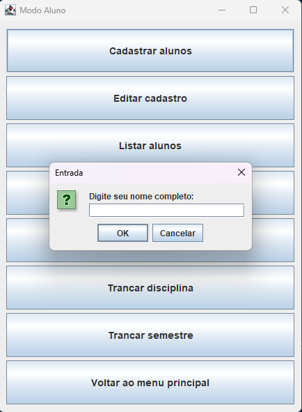

# Sistema Acadêmico - FCTE

## Descrição do Projeto

Desenvolvimento de um sistema acadêmico para gerenciar alunos, disciplinas, professores, turmas, avaliações e frequência, utilizando os conceitos de orientação a objetos (herança, polimorfismo e encapsulamento) e persistência de dados em arquivos.

## Dados do Aluno

- **Nome completo:** Lucas Ferreira Santana
- **Matrícula:** 242024253
- **Curso:** Engenharias
- **Turma:** 06

---

## Instruções para Compilação e Execução

1. **Compilação:**  
   Clonar repositorio na IDE com o comando: git clone https://github.com/Luc4sF3rreira/ep1-OO-2025_1.git

2. **Execução:**  
   Executar o arquivo SistemaAcademico.java no botão Run Java

3. **Estrutura de Pastas:**  
EP1 OO/
├── src/
│   |
│   |
│   ├── Aluno.java                              # Classe abstrata base
│   ├── AlunoEspecial.java                      # Herança - aluno especial
│   ├── Avaliacao.java                          # Dados da avaliação
│   ├── Disciplina.java                         # Dados das disciplina
│   ├── JanelaAluno.java                        # Janela do Modo Aluno na interface gráfica
│   ├── JanelaAvaliacao_Frequencia.java         # Janela do Modo Avaliação/Frequência na interface gráfica
│   ├── JanelaDisciplina_Turma.java             # Janela do Modo Disciplina/Turma na interface gráfica
│   ├── JanelaPrincipal.java                    # Janela que liga todos os modos na interface gráfica
│   ├── ModoAluno.java                          # Métodos do Modo Aluno  
│   ├── ModoAvaliacao_Frequencia.java           # Métodos do Modo Avaliação/Frequência 
│   ├── ModoDisciplina_Turma.java               # Métodos do Modo Disciplina/Turma  
│   ├── SistemaAcademico.java                   # Classe principal com a interface gráfica     
│   └── Turmas.java                             # Dados das turmas
│
│                                      
├── alunos.txt                                # Arquivo de persistência dos
├── bin/                                      # Arquivos compilados (.class)
├── disciplinas.txt                           # Arquivo de persistência das disciplinas
├── README.md                                 # Este arquivo
└── turmas.txt                                # Arquivo de persistência das turmas

3. **Versão do JAVA utilizada:**  
   java 21.0.6

---

## Vídeo de Demonstração

- [Inserir o link para o vídeo no YouTube/Drive aqui]

---

## Prints da Execução

1. Menu Principal:  
   

2. Cadastro de Aluno:  
   

3. Detalhes da turma no modo disciplina/turma:
   

---

## Principais Funcionalidades Implementadas

- [✓] Cadastro, listagem, matrícula e trancamento de alunos (Normais e Especiais)
- [✓] Cadastro de disciplinas e criação de turmas (presenciais e remotas)
- [✓] Matrícula de alunos em turmas, respeitando vagas e pré-requisitos
- [✓] Lançamento de notas e controle de presença
- [✓] Cálculo de média final e verificação de aprovação/reprovação
- [ ] Relatórios de desempenho acadêmico por aluno, turma e disciplina
- [✓] Persistência de dados em arquivos (.txt ou .csv)
- [✓] Tratamento de duplicidade de matrículas
- [✓] Uso de herança, polimorfismo e encapsulamento

---

## Observações (Extras ou Dificuldades)

- Estava com dificuldades em relação ao metodo de imprimir os relatórios, porque não estava pegando as notas que eu havia calculado no metodo anterior que era
justamente o de lançar as notas.

---

## Contato

- Email: lucas.santana220206@gmail.com
